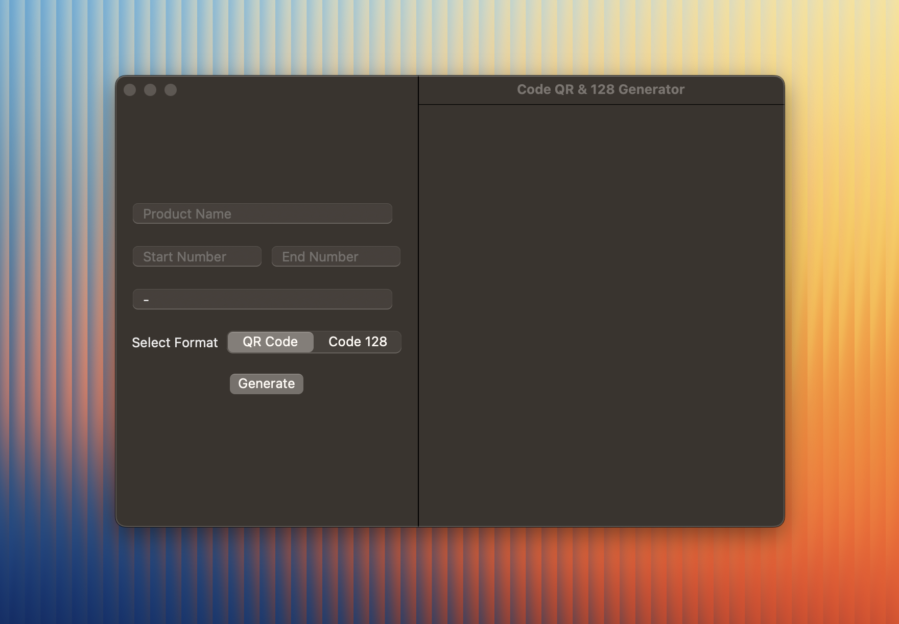

# QR Code & Code 128 Generator

A powerful macOS application built with SwiftUI that allows users to generate high-quality **QR Codes** and **Code 128 barcodes**. Perfect for managing product labels, inventory tracking, or any scenario requiring visually clean and accurate code generation.

## Features

### 🛠 Flexible Code Formats  
- **Multiple Code Formats**: Generate either QR codes or Code 128 barcodes.
- **Customizable Range**: Specify a range of numbers to create multiple codes in one go.
- **Text Delimiter**: Add a custom delimiter (e.g., `-`, `_`, `/`) between the product name and the number in the code.
- **White QR Code Option**: Toggle between black and white QR codes.
- **Batch Export**: Codes are exported as PNG files in a dedicated folder within the `Downloads` directory.
- **Text on Barcode**: Displays text below the Code 128 barcodes for added clarity. 

## How to Use
1.	Enter the Product Name in the provided text field.
2.	Specify the Start Number and End Number for the numeric range.
3.	Add a Delimiter (e.g., -, _, /) if desired.
4.	Select the Code Format (QR Code or Code 128).
5.	[Optional] If generating QR codes, toggle the Use White QR Code option to create white codes.
6.	Click the Generate button. The app will:
- Create a folder in your Downloads directory named after your product and code format.
-	Generate PNG images for each code in the specified range.
-	Automatically open the folder upon completion.

### ⚡ Batch Generation  
Generate codes in bulk by providing a start and end range. The app automatically organizes your files into corresponding folders:  
- `ProductName_qr` for QR Codes  
- `ProductName_128` for Code 128 Barcodes  

### ‼️ Important Note  
#### Download the Project:
1. After downloading the project, navigate to the **QRCodeGenerator** folder.
2. Open the **QRCodeGenerator App**.
3. Move the app to the **Applications** folder on your computer.

#### Or if you want to apply changes:

After opening the project in Xcode, follow these steps to build and use the app:

1. Go to **Product** in the menu bar.
2. Select **Archive**.
3. Click on **Distribute App**.
4. Choose **Custom** and then select **Copy App**.
5. Click **Export**.
6. Move the exported `.app` file to your Mac's **Applications** folder.

### 📂 Smart File Management  
All codes are saved in the `Downloads` folder under format-specific directories for easy access and organization.  

### 🧑‍💻 User-Friendly Interface  
- Modern SwiftUI design for smooth navigation.  
- Real-time progress indicator during generation.  
- Clear error messages for invalid input or generation issues.  

## Tech Stack  
- **SwiftUI**: Provides a sleek, native macOS interface.  
- **Core Image Filters**: Used for QR Code and barcode generation with customizable styles.  
- **macOS Native APIs**: `FileManager` for file handling, `NSWorkspace` for opening directories.  

This application is compatible with **macOS 15 (Sequoia)** and later.(maybe you can change it from settings I didn't try it) 

## Screenshots  
  
